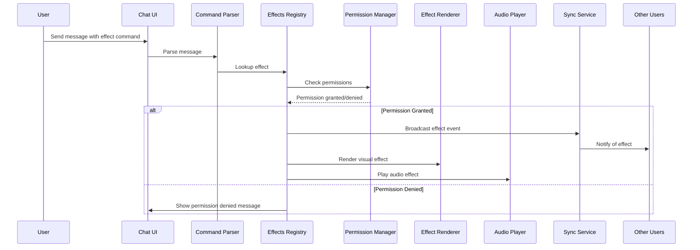

# Design Document: Effect TypeScript Library Integration

## Overview

This design document outlines the integration of the Effect TypeScript library into our chat application. Effect is a functional programming library for TypeScript that provides tools for managing side effects, handling asynchronous operations, and building more predictable applications. By integrating Effect into our chat application, we aim to improve code quality, error handling, and overall application reliability.

## Architecture

The Chat Effects System will follow a modular architecture with the following key components:

1. **Effects Registry**: A central registry that maintains all available effects, their triggers, and metadata.
2. **Effect Renderer**: Responsible for rendering visual effects on the client side.
3. **Audio Player**: Handles the playback of audio effects with proper queuing and volume control.
4. **Effects Command Parser**: Parses chat messages to identify effect trigger commands.
5. **Effects Permission Manager**: Enforces room-level and user-level permissions for effects.
6. **Effects Settings Manager**: Manages user preferences for effects.
7. **Effects Synchronization Service**: Ensures effects are synchronized across all users in a room.

### System Flow



## Components and Interfaces

### 1. Effects Registry

The Effects Registry will be implemented as a singleton service that manages all available effects.

```typescript
interface EffectDefinition {
  id: string;
  name: string;
  description: string;
  type: 'visual' | 'audio' | 'combined';
  triggers: string[];
  visualComponent?: React.ComponentType<EffectProps>;
  audioSrc?: string;
  defaultEnabled: boolean;
  resourceIntensity: 'low' | 'medium' | 'high';
}

class EffectsRegistry {
  private effects: Map<string, EffectDefinition>;
  
  registerEffect(effect: EffectDefinition): void;
  getEffect(id: string): EffectDefinition | undefined;
  getEffectByTrigger(trigger: string): EffectDefinition | undefined;
  getAllEffects(): EffectDefinition[];
  removeEffect(id: string): boolean;
}
```

### 2. Effect Renderer

The Effect Renderer will be responsible for displaying visual effects in the chat UI.

```typescript
interface EffectProps {
  roomId: string;
  triggeredBy: string;
  duration?: number;
  intensity?: number;
  customParams?: Record<string, any>;
}

interface EffectRendererOptions {
  container: HTMLElement;
  maxConcurrentEffects?: number;
}

class EffectRenderer {
  private activeEffects: Map<string, React.ReactNode>;
  private container: HTMLElement;
  private maxConcurrentEffects: number;
  
  constructor(options: EffectRendererOptions);
  
  renderEffect(effect: EffectDefinition, props: EffectProps): string;
  removeEffect(effectInstanceId: string): void;
  clearAllEffects(): void;
}
```

### 3. Audio Player

The Audio Player will handle the playback of audio effects with proper queuing and volume control.

```typescript
interface AudioEffectOptions {
  volume?: number;
  loop?: boolean;
  duration?: number;
}

class AudioEffectPlayer {
  private audioQueue: Array<{src: string, options: AudioEffectOptions}>;
  private currentlyPlaying: HTMLAudioElement | null;
  private globalVolume: number;
  
  constructor(globalVolume?: number);
  
  playEffect(src: string, options?: AudioEffectOptions): string;
  stopEffect(effectId: string): void;
  pauseAllEffects(): void;
  resumeAllEffects(): void;
  setGlobalVolume(volume: number): void;
}
```

### 4. Effects Command Parser

The Effects Command Parser will identify and extract effect commands from chat messages.

```typescript
interface ParsedEffectCommand {
  effectTrigger: string;
  params: Record<string, string>;
  originalMessage: string;
  messageWithoutCommand: string;
}

class EffectCommandParser {
  private triggerPrefix: string;
  
  constructor(triggerPrefix?: string);
  
  parseMessage(message: string): ParsedEffectCommand | null;
  extractParams(commandString: string): Record<string, string>;
}
```

### 5. Effects Permission Manager

The Effects Permission Manager will enforce room-level and user-level permissions for effects.

```typescript
interface EffectPermission {
  effectId: string;
  allowed: boolean;
}

interface RoomEffectSettings {
  roomId: string;
  effectsEnabled: boolean;
  specificPermissions: EffectPermission[];
}

class EffectPermissionManager {
  private roomSettings: Map<string, RoomEffectSettings>;
  
  getRoomSettings(roomId: string): RoomEffectSettings;
  updateRoomSettings(settings: RoomEffectSettings): void;
  canUseEffect(userId: string, roomId: string, effectId: string): boolean;
}
```

### 6. Effects Settings Manager

The Effects Settings Manager will handle user preferences for effects.

```typescript
interface UserEffectSettings {
  userId: string;
  effectsEnabled: boolean;
  visualEffectsEnabled: boolean;
  audioEffectsEnabled: boolean;
  audioVolume: number;
  specificEffectSettings: Record<string, {enabled: boolean, volume?: number}>;
}

class UserEffectSettingsManager {
  getUserSettings(userId: string): Promise<UserEffectSettings>;
  updateUserSettings(settings: UserEffectSettings): Promise<void>;
  getEffectEnabledForUser(userId: string, effectId: string): Promise<boolean>;
}
```

### 7. Effects Synchronization Service

The Effects Synchronization Service will ensure effects are synchronized across all users in a room.

```typescript
interface EffectEvent {
  effectId: string;
  roomId: string;
  triggeredBy: string;
  timestamp: number;
  params: Record<string, any>;
}

class EffectSynchronizationService {
  broadcastEffect(event: EffectEvent): Promise<void>;
  subscribeToEffects(roomId: string, callback: (event: EffectEvent) => void): () => void;
}
```

## Data Models

### Effect Definition

```typescript
interface EffectDefinition {
  id: string;
  name: string;
  description: string;
  type: 'visual' | 'audio' | 'combined';
  triggers: string[];
  visualComponent?: React.ComponentType<EffectProps>;
  audioSrc?: string;
  defaultEnabled: boolean;
  resourceIntensity: 'low' | 'medium' | 'high';
  metadata?: {
    author?: string;
    version?: string;
    tags?: string[];
    previewImage?: string;
  };
}
```

### User Effect Settings

```typescript
interface UserEffectSettings {
  userId: string;
  effectsEnabled: boolean;
  visualEffectsEnabled: boolean;
  audioEffectsEnabled: boolean;
  audioVolume: number;
  specificEffectSettings: Record<string, {
    enabled: boolean;
    volume?: number;
    customParams?: Record<string, any>;
  }>;
  performanceMode: 'auto' | 'low' | 'medium' | 'high';
}
```

### Room Effect Settings

```typescript
interface RoomEffectSettings {
  roomId: string;
  effectsEnabled: boolean;
  specificPermissions: Array<{
    effectId: string;
    allowed: boolean;
  }>;
  defaultPermission: boolean;
}
```

### Effect Event

```typescript
interface EffectEvent {
  id: string;
  effectId: string;
  roomId: string;
  triggeredBy: string;
  timestamp: number;
  duration?: number;
  params: Record<string, any>;
}
```

## Error Handling

The Chat Effects System will implement comprehensive error handling to ensure a smooth user experience:

1. **Effect Not Found**: When a user triggers a non-existent effect, the system will log the error and provide feedback to the user.

2. **Permission Denied**: When a user attempts to use an effect they don't have permission for, the system will display a clear message explaining why the effect couldn't be triggered.

3. **Resource Limitations**: If a device cannot handle certain effects due to resource constraints, the system will automatically adjust or disable those effects and notify the user.

4. **Audio Playback Issues**: If audio effects cannot be played (e.g., browser restrictions), the system will fall back to visual-only mode and inform the user.

5. **Synchronization Failures**: If effect synchronization fails, the system will retry with exponential backoff and eventually degrade gracefully to local-only effects if necessary.

## Testing Strategy

### Unit Testing

1. Test each component in isolation with mock dependencies:
   - Effects Registry: Test registration, retrieval, and removal of effects
   - Effect Renderer: Test rendering and cleanup of effects
   - Audio Player: Test playback, queuing, and volume control
   - Command Parser: Test parsing of various command formats
   - Permission Manager: Test permission checks and updates
   - Settings Manager: Test retrieval and update of user settings

### Integration Testing

1. Test the interaction between components:
   - Command parsing to effect triggering
   - Permission checks during effect triggering
   - Settings application during effect rendering/playback

### End-to-End Testing

1. Test the complete flow from user input to effect display across multiple clients:
   - Effect triggering and synchronization
   - Permission enforcement
   - Settings application

### Performance Testing

1. Test the system under various loads:
   - Multiple concurrent effects
   - High-frequency effect triggering
   - Effects in rooms with many users

2. Test on various device capabilities:
   - Low-end devices
   - Mobile devices
   - Different browsers

### Accessibility Testing

1. Ensure effects do not cause accessibility issues:
   - No rapidly flashing content that could trigger seizures
   - Effects can be disabled for users with sensitivities
   - Audio effects respect system volume settings

## Implementation Considerations

### Performance Optimization

1. **Lazy Loading**: Effects will be loaded only when needed to reduce initial load time.
2. **Resource Pooling**: Reuse effect instances when possible to reduce memory usage.
3. **Throttling**: Limit the number of concurrent effects to maintain performance.
4. **Adaptive Quality**: Adjust effect complexity based on device capabilities.

### Accessibility

1. **Reduced Motion**: Respect user's reduced motion preferences.
2. **Volume Control**: Provide fine-grained control over audio effect volume.
3. **Alternative Indicators**: Provide non-visual indicators for audio effects.

### Cross-Browser Compatibility

1. Use standardized APIs when possible.
2. Implement fallbacks for browsers with limited support.
3. Test across major browsers (Chrome, Firefox, Safari, Edge).

### Mobile Considerations

1. Optimize effects for touch interfaces.
2. Consider battery and data usage for mobile devices.
3. Implement mobile-specific optimizations for effect rendering.

## Future Enhancements

1. **Effect Marketplace**: Allow users to discover and install community-created effects.
2. **Effect Combinations**: Enable triggering of multiple effects in sequence or simultaneously.
3. **Contextual Effects**: Effects that react to chat content or user behavior.
4. **Custom Effect Creation**: In-app tools for users to create their own simple effects.
5. **Effect Analytics**: Track usage and performance of different effects to guide future development.### 2. Cha
t Message Handling with Effect

```typescript
import { Effect, pipe } from "effect";
import { Message, ValidationError } from "../types";

// Message validation
export const validateMessage = (message: unknown): Effect.Effect<Message, ValidationError, never> => {
  return Effect.try({
    try: () => {
      // Validation logic
      if (typeof message !== "object" || message === null) {
        throw new ValidationError("Message must be an object");
      }
      
      const msg = message as Partial<Message>;
      
      if (!msg.content || typeof msg.content !== "string") {
        throw new ValidationError("Message must have content as string");
      }
      
      if (!msg.userId || typeof msg.userId !== "string") {
        throw new ValidationError("Message must have userId as string");
      }
      
      return {
        id: msg.id || crypto.randomUUID(),
        content: msg.content,
        userId: msg.userId,
        timestamp: msg.timestamp || Date.now(),
        type: msg.type || "text"
      } as Message;
    },
    catch: (error) => {
      if (error instanceof ValidationError) {
        return error;
      }
      return new ValidationError(`Unknown validation error: ${String(error)}`);
    }
  });
};

// Send message effect
export const sendMessage = (message: Message): Effect.Effect<void, Error, never> => {
  return pipe(
    validateMessage(message),
    Effect.flatMap(validatedMessage => 
      apiEffect("/api/chat", {
        method: "POST",
        headers: { "Content-Type": "application/json" },
        body: JSON.stringify(validatedMessage)
      })
    ),
    Effect.retry(standardRetryPolicy),
    Effect.catchAll(error => Effect.logError(`Failed to send message: ${error.message}`))
  );
};
```

### 3. Room Management with Effect

```typescript
import { Effect, pipe } from "effect";
import { Room, RoomError } from "../types";

// Room creation
export const createRoom = (roomData: Partial<Room>): Effect.Effect<Room, RoomError, never> => {
  return pipe(
    Effect.try({
      try: () => {
        // Validation logic
        if (!roomData.name || typeof roomData.name !== "string") {
          throw new RoomError("Room must have a name");
        }
        
        return {
          id: roomData.id || crypto.randomUUID(),
          name: roomData.name,
          createdBy: roomData.createdBy,
          createdAt: roomData.createdAt || Date.now(),
          members: roomData.members || [],
          settings: roomData.settings || { effectsEnabled: true }
        } as Room;
      },
      catch: (error) => new RoomError(`Room validation failed: ${String(error)}`)
    }),
    Effect.flatMap(validatedRoom => 
      apiEffect<Room>("/api/rooms", {
        method: "POST",
        headers: { "Content-Type": "application/json" },
        body: JSON.stringify(validatedRoom)
      })
    ),
    Effect.mapError(error => {
      if (error instanceof RoomError) {
        return error;
      }
      return new RoomError(`Failed to create room: ${error.message}`);
    })
  );
};
```#
## 4. React Integration Layer

```typescript
import { useEffect, useState } from "react";
import { Effect, Exit } from "effect";

// Custom hook for running Effect in React components
export function useEffectRunner<A, E>(
  effect: Effect.Effect<A, E, never>,
  deps: React.DependencyList = []
) {
  const [state, setState] = useState<{
    status: "idle" | "loading" | "success" | "error";
    data?: A;
    error?: E;
  }>({ status: "idle" });

  useEffect(() => {
    setState({ status: "loading" });
    
    const runtime = Effect.runPromiseExit(effect);
    
    runtime.then((exit) => {
      Exit.match(exit, {
        onFailure: (cause) => {
          const error = Effect.Cause.failureOrCause(cause);
          setState({ status: "error", error });
        },
        onSuccess: (data) => {
          setState({ status: "success", data });
        }
      });
    });
    
    return () => {
      // Cleanup if needed
    };
  }, deps);

  return state;
}

// Example usage in a component
function ChatRoom({ roomId }: { roomId: string }) {
  const userId = "user123"; // From auth context
  
  const joinRoomState = useEffectRunner(
    joinRoom(roomId, userId),
    [roomId, userId]
  );
  
  if (joinRoomState.status === "loading") {
    return <div>Joining room...</div>;
  }
  
  if (joinRoomState.status === "error") {
    return <div>Error: {joinRoomState.error?.message || "Unknown error"}</div>;
  }
  
  return (
    <div>
      <h1>{joinRoomState.data?.name}</h1>
      {/* Chat room UI */}
    </div>
  );
}
```

## Data Models

### Core Types

```typescript
// Define core types for the application
import { Effect } from "effect";

// Base error types
export class AppError extends Error {
  constructor(message: string) {
    super(message);
    this.name = "AppError";
  }
}

export class ValidationError extends AppError {
  constructor(message: string) {
    super(message);
    this.name = "ValidationError";
  }
}

export class AuthError extends AppError {
  constructor(message: string) {
    super(message);
    this.name = "AuthError";
  }
}

export class RoomError extends AppError {
  constructor(message: string) {
    super(message);
    this.name = "RoomError";
  }
}

// Domain models
export interface User {
  id: string;
  username: string;
  displayName: string;
  avatarUrl?: string;
}

export interface Message {
  id: string;
  content: string;
  userId: string;
  roomId: string;
  timestamp: number;
  type: "text" | "image" | "system";
}

export interface Room {
  id: string;
  name: string;
  createdBy: string;
  createdAt: number;
  members: string[];
  settings: {
    effectsEnabled: boolean;
    [key: string]: any;
  };
}
```## Error H
andling

The Effect library provides robust error handling capabilities that we'll leverage throughout the application:

1. **Typed Errors**: All errors are typed, making error handling more predictable and comprehensive.

2. **Error Recovery**: Effect's error handling allows for graceful recovery from failures:

```typescript
const handleMessageSend = (message: Message) => {
  return pipe(
    sendMessage(message),
    Effect.catchTag("NetworkError", (error) => {
      // Store message locally for retry
      return Effect.sync(() => {
        localStorage.setItem(`pending_message_${message.id}`, JSON.stringify(message));
        return { status: "queued", message };
      });
    }),
    Effect.catchTag("ValidationError", (error) => {
      // Show validation error to user
      return Effect.sync(() => {
        return { status: "invalid", error: error.message };
      });
    }),
    Effect.catchAll((error) => {
      // Generic error handling
      return Effect.sync(() => {
        console.error("Failed to send message:", error);
        return { status: "error", error: "Failed to send message" };
      });
    })
  );
};
```

3. **Retry Policies**: Automatic retries for transient failures:

```typescript
const fetchWithRetry = <T>(url: string): Effect.Effect<T, Error, never> => {
  return pipe(
    apiEffect<T>(url),
    Effect.retry({
      retries: 3,
      backoff: "exponential",
      factor: 2,
      maxDelay: 30000, // 30 seconds
      jitter: true
    })
  );
};
```

## Testing Strategy

Effect's design makes testing significantly easier and more reliable:

### Unit Testing

1. **Pure Function Testing**: Effect encourages pure functions that are easy to test:

```typescript
describe("validateMessage", () => {
  it("should validate a valid message", () => {
    const message = {
      content: "Hello",
      userId: "user123"
    };
    
    return Effect.runPromise(
      pipe(
        validateMessage(message),
        Effect.map(result => {
          expect(result.content).toBe("Hello");
          expect(result.userId).toBe("user123");
          expect(result.id).toBeDefined();
        })
      )
    );
  });
  
  it("should fail for invalid message", () => {
    const invalidMessage = {
      // Missing userId
      content: "Hello"
    };
    
    return Effect.runPromise(
      pipe(
        validateMessage(invalidMessage),
        Effect.match({
          onSuccess: () => fail("Should not succeed"),
          onFailure: (error) => {
            expect(error.message).toContain("userId");
          }
        })
      )
    );
  });
});
```

## Implementation Considerations

### Performance Optimization

1. **Lazy Evaluation**: Effect operations are lazy and only executed when run, reducing unnecessary computations.

2. **Caching**: Implement caching for expensive operations:

```typescript
import { Effect, Cache } from "effect";

// Create a cache for room data
const roomCache = Cache.make({
  capacity: 100,
  timeToLive: "10 minutes"
});

// Use the cache in room fetching
const getRoomWithCache = (roomId: string) => {
  return Cache.get(roomCache, roomId, () => 
    apiEffect<Room>(`/api/rooms/${roomId}`)
  );
};
```

### Incremental Migration Strategy

1. **Identify Key Areas**: Start by migrating error-prone or complex asynchronous code.

2. **Create Effect Wrappers**: Wrap existing functions with Effect equivalents.

3. **Gradual Component Migration**: Update React components one at a time.

## Future Enhancements

1. **Effect-Based State Management**: Replace or integrate with existing state management solutions.

2. **Server-Side Integration**: Extend Effect usage to server-side code for end-to-end type safety.

3. **Advanced Concurrency Patterns**: Implement more sophisticated concurrency control using Effect's capabilities.

4. **Custom Effect Middleware**: Develop middleware for application-specific concerns.

5. **Effect Schema Integration**: Use Effect's schema capabilities for more robust validation and parsing.